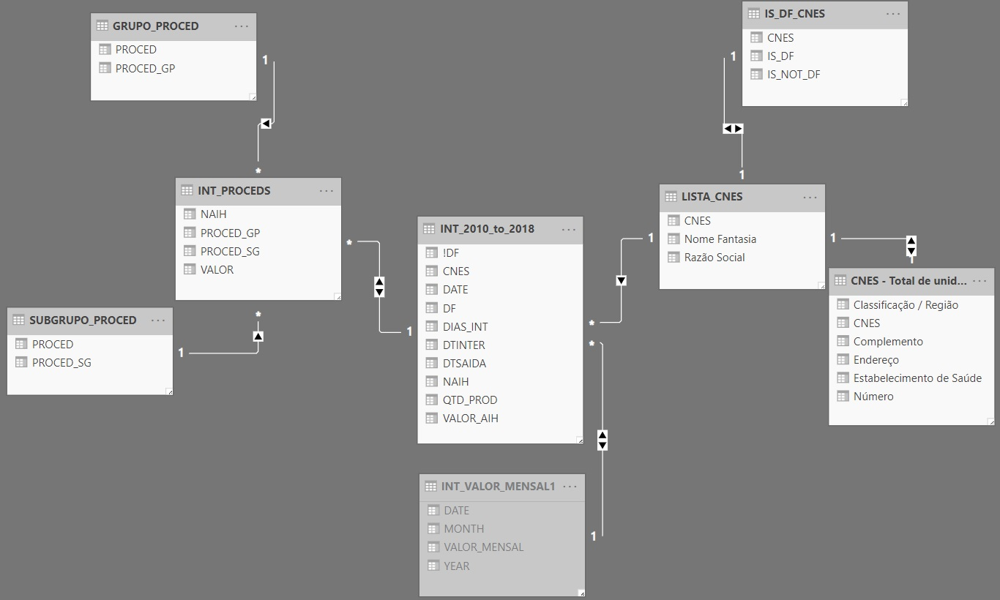
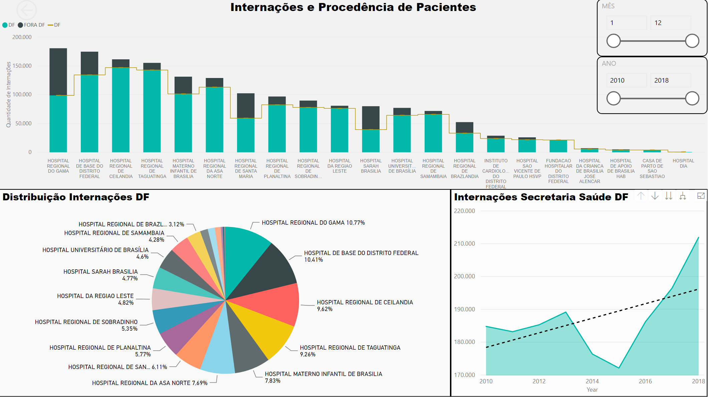
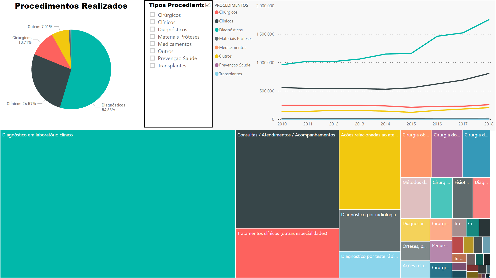
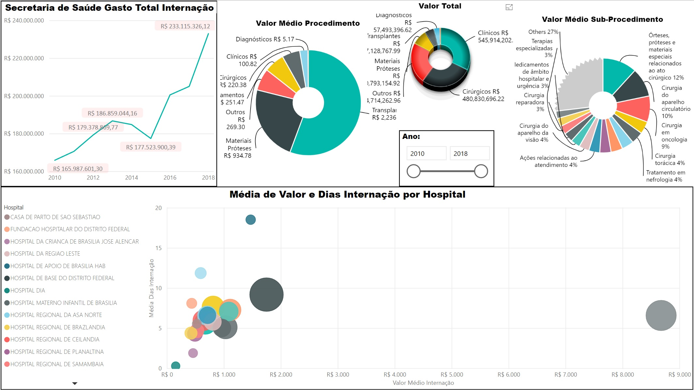
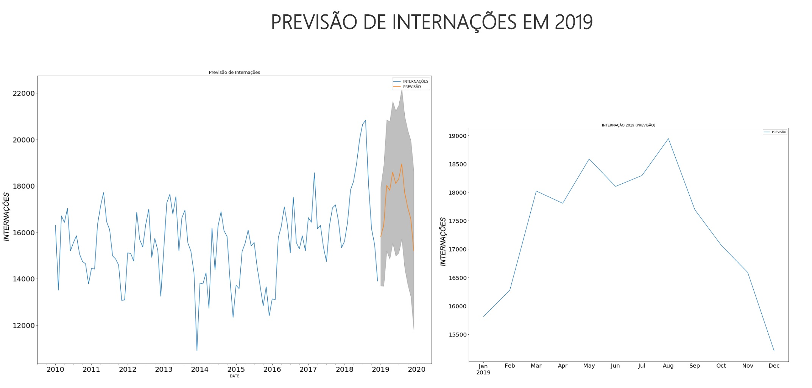

# Hospitalization Analysis SESDF

Analysis on patient's hospitalizations throughout state health institutions of Federal District of Brazil.


<br />

1- The Data
---------------

The Data is the hospitalizations of Federal District from year 2010 to 2018.

The Data is composed by 108 files with 37 columns, ~20 million of rows and 4.74GB size.

Only 9 columns was selected to analysis and the overall explanation for this is on columns_explanation.md file.

**Getting Data**

The Data was obtained from DataSUS (IT Health Department of Brazil), this sector is related to Ministry of Health of Brazil.

Link: [DataSUS](http://www2.datasus.gov.br/DATASUS/index.php?area=0901&item=1&acao=25)

The files are formatted in (.dbc) which is the compressed form (.dbf) dBase III format.
I used the dbf2dbc.exe (Decompresser Program DBC to DBF), but due there were 108 files to process a batch script was created to deal with all files in a row.

The Batch script: 
```
for %%f in (*.dbc) do call dbf2dbc.exe %%f
```

Link: [Program dbf2dbc explanation](http://www2.datasus.gov.br/DATASUS/index.php?area=060805&item=6#dbf2dbc)

After the processing, I've got each (.dbf) file and sent it to pandas Dataframe. This whole process is explained on notebooks.


<br />

2- Objectives
---------------------------------------------

- Analyze the relations between hospitalizations and public health institutions.
- Check and balance the origin of patients
- Correlate the costs of medical procedures and hospitalizations
- Predict the number of hospitalizations in 2019


<br />

3- Data Wrangling and Machine Learning
---------------------------------------------

The whole process of Data preparation and Machine Learning was explained on:
- Português (BR): [Notebook](hosp_analysis_PTBR_version.ipynb)
- English (US): [Notebook](hosp_analysis_US_version.ipynb)

<br />


4- Power BI and Visualization
---------------------------------------------

The DataSUS data about health institutions and medical procedures are only codes (numbers) which represent nothing to real world. I had to connect this numbers to real names of places and the procedures, that's why I've made a deep search on SUS (Unique Health System) for tabular data of Hospital names and procedures names from codes. As a result, this relationship model was created into Power BI:

<br />



<br />

The (INT_PROCEDS) is from original Dataset (INT_2010_to_2018), and also connected  with Group of Procedures(PROCED_GP) and Subgroup of Procedures(PROCED_SG), I've got a excel tabular data about this data containing the codes and the name of medical procedures, so I related the names with the codes on (INT_PROCEDS) to inform correct name to main dataset INT_2010_to_2018.

File: 

What's more, the same was done with (LISTA_CNES & CNES - Total de Unidades), I've connected the names with the health institutions codes (CNES) on main dataset (INT_2010_to_2018) to show correct names on graphs.

File:


As a result, visualizations was made on Power BI from data in order to compare and get insights.

My reports on Power BI web link: [Hospitalization Report](https://app.powerbi.com/view?r=eyJrIjoiMTM1NDc2MjMtMDUzOC00MzVjLWE1MDYtN2Q0NDFkNDk3YzE1IiwidCI6IjE1MDQ5MTM2LTE1MGMtNGNlYy1iMjY5LTk2YTM2M2QwZGYyZiIsImMiOjF9&pageName=ReportSection1)


***CLICK ON IMAGES to access the View on Web Power BI App**

<br />

- **Report Section 1 - Hospitalizations** 

[](https://app.powerbi.com/view?r=eyJrIjoiMTM1NDc2MjMtMDUzOC00MzVjLWE1MDYtN2Q0NDFkNDk3YzE1IiwidCI6IjE1MDQ5MTM2LTE1MGMtNGNlYy1iMjY5LTk2YTM2M2QwZGYyZiIsImMiOjF9&pageName=ReportSection1)

<br />

- **Report Section 2 - Medical Procedures** 

[](https://app.powerbi.com/view?r=eyJrIjoiMTM1NDc2MjMtMDUzOC00MzVjLWE1MDYtN2Q0NDFkNDk3YzE1IiwidCI6IjE1MDQ5MTM2LTE1MGMtNGNlYy1iMjY5LTk2YTM2M2QwZGYyZiIsImMiOjF9&pageName=ReportSection2)

<br />

- **Report Section 3 - Cost and Values**

[](https://app.powerbi.com/view?r=eyJrIjoiMTM1NDc2MjMtMDUzOC00MzVjLWE1MDYtN2Q0NDFkNDk3YzE1IiwidCI6IjE1MDQ5MTM2LTE1MGMtNGNlYy1iMjY5LTk2YTM2M2QwZGYyZiIsImMiOjF9&pageName=ReportSection3)

<br />

- **Report Section 4 - Prediction**

[](https://app.powerbi.com/view?r=eyJrIjoiMTM1NDc2MjMtMDUzOC00MzVjLWE1MDYtN2Q0NDFkNDk3YzE1IiwidCI6IjE1MDQ5MTM2LTE1MGMtNGNlYy1iMjY5LTk2YTM2M2QwZGYyZiIsImMiOjF9&pageName=ReportSection4)
